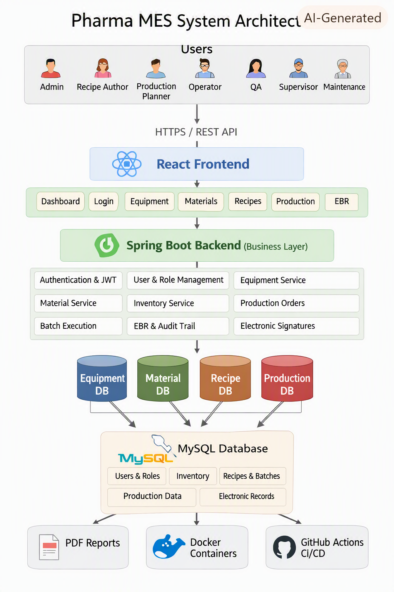

# pharma-MES-Application
  For the deep understanding of MES I am developing a world class MES Application which completes it by satisfying ISA-95, ISA-88, GAMP 5, GMP & 21 CFR Part 11
  i am having a 60 day sprint prepared and i am having tasks that i will do everyday like documenting every steps every challenges faced every break throughs 
  and post it here 
# Pharma MES System

## Overview
A pharmaceutical Manufacturing Execution System built using:

- Java Spring Boot
- React
- MySQL
- JWT Authentication
- Docker

## Modules
- Authentication
- Equipment
- Materials
- Recipes
- Production
- EBR
- Audit Trail
- Electronic Signatures

## Technology Stack
**Backend:**
- Java
- Spring Boot

**Frontend:**
- React

**Database:**
- MySQL

**Version Control:**
- Git

---

## Architecture Diagram

The Pharma MES system follows a layered architecture:
- **Users** interact through the React Frontend.
- **React Frontend** communicates via HTTPS/REST API.
- **Spring Boot Backend** handles authentication, business logic, and services.
- **MySQL Database** stores all master and transactional data.
- **DevOps Layer** manages CI/CD with Docker and GitHub Actions.

---

## Project Backlog
| Epic            | Feature               | Priority |
|-----------------|-----------------------|----------|
| Authentication  | Login                 | High     |
| Authentication  | JWT                   | High     |
| Equipment       | Equipment CRUD        | High     |
| Materials       | Material Master       | High     |
| Inventory       | Inventory Tracking    | High     |
| Recipes         | Recipe Management     | High     |
| Production      | Production Orders     | High     |
| Production      | Batch Execution       | High     |
| Compliance      | EBR                   | High     |
| Compliance      | Audit Trail           | High     |
| Compliance      | Electronic Signatures | High     |
| Reports         | Dashboards            | Medium   |
| DevOps          | Docker                | Medium   |
| DevOps          | GitHub Actions        | Medium   |

---

## Tools & Practices
- **DevOps** → CI/CD pipelines, containerization  
- **GitHub Actions** → Automated workflows and testing  
- **Medium** → Knowledge sharing and documentation  
